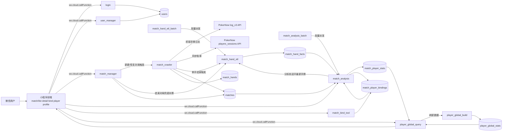

# PokerNow Analysis 小程序技术架构与功能总结

## 1) 技术架构总览

该项目采用 **微信小程序前端 + 微信云开发后端（云函数 + 云数据库）** 的典型 Serverless 架构：

- 前端：原生小程序页面（WXML/WXSS/JS）与 TabBar 导航，负责登录态、对局列表、详情展示、身份绑定、个人资料编辑。
- 网关：通过 `wx.cloud.callFunction` 调用云函数，不自建传统 HTTP API 服务。
- 业务后端：云函数拆分为登录、用户管理、对局管理、爬虫采集、手牌 ETL、数据分析、绑定工具、玩家总榜构建/查询，并包含批处理接力函数。
- 数据层：云数据库集合包括 `matches`、`match_hands`、`match_hand_facts`、`match_player_bindings`、`match_player_stats`、`player_global_stats`、`users`。
- 外部数据源：爬虫云函数从 PokerNow 接口抓取手牌日志与账单，持续回写数据库。

## 2) 架构图（Mermaid）

## 3) 主要模块职责

### 前端（`miniprogram/`）

- `app.js`：初始化云环境、获取 openid、检查登录状态并维护全局登录信息。
- `pages/match/list`：对局列表、创建对局、暂停/继续爬取、结束/删除对局、跳转详情与绑定。
- `pages/match/detail`：加载某场对局元信息与分析结果（统计指标、排序、复制战绩、重命名等交互）。
- `pages/match/bind`：绑定/解绑玩家位与格局ID映射，控制进行中与已结束场景下的数据展示。
- `pages/profile`：用户注册/登录资料（头像、昵称、格局ID）维护。
- `pages/player`：聚合玩家维度展示入口。

### 云函数（`cloudfunctions/`）

- `login`：返回调用者 `openid`/`appid` 等身份上下文。
- `user_manager`：用户资料创建/更新/查询。
- `match_manager`：
  - 对局列表、创建、删除、状态切换；
  - 结束对局时补算真实开始/结束时间；
  - 启停时联动触发 `match_crawler`。
- `match_crawler`：循环抓取 PokerNow 日志，按手牌写入 `match_hands`，同步账单到 `matches`，具备超时接力与异常自动暂停机制。
- `match_hand_etl`：将 `match_hands` 原始日志转换为 `match_hand_facts` 基础事实层，支持按单手增量补算和接力。
- `match_analysis`：读取手牌日志与绑定关系，计算 VPIP/PFR/AF/WTSD/WSD 等统计并写回分析结果。
- `match_hand_etl_batch` / `match_analysis_batch`：批量任务入口，分片调用 ETL/分析云函数，超时后自动接力。
- `match_bind_tool`：提供 openid、可绑定格局ID列表、执行绑定与解绑。
- `player_global_build` / `player_global_query`：构建并查询跨局玩家总榜（`player_global_stats`），支持前端一键刷新。

## 4) 核心业务流程

1. 用户在列表页提交 PokerNow 链接创建对局。
2. `match_manager` 创建 `matches` 记录，并异步拉起 `match_crawler`。
3. `match_crawler` 按 handNumber 轮询 PokerNow API，持续写入 `match_hands`、更新 `matches.currentHandNumber/ledger`。
4. 详情页调用 `match_analysis`，基于 `match_hands + match_player_bindings + users` 产出统计指标与风格数据。
5. 绑定页调用 `match_bind_tool` 维护玩家位到用户身份（格局ID）的映射。
6. 对局结束后由 `match_manager` 标记状态并计算真实时间区间，用于复盘展示。

## 5) 功能清单（按用户视角）

- 对局管理：新建、列表轮询、暂停/恢复、结束、删除。
- 数据分析：核心扑克指标（VPIP、PFR、AF、WTSD、WSD 等）与排行展示。
- 身份绑定：玩家位认领/解绑，多昵称归并到同一用户标识。
- 隐私与阶段化展示：进行中限制敏感映射、结束后复盘放开。
- 用户中心：头像/昵称/格局ID维护、登录态管理。
- 社交辅助：战绩复制、冠军重命名等复盘互动能力。
